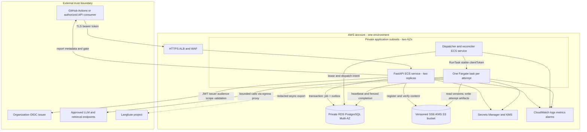
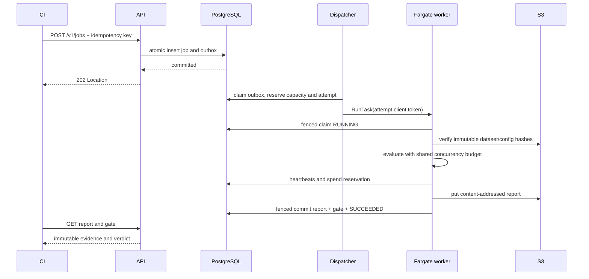

# Architecture

Status: production target design. The [Phase 3.1 local subset](docs/local-service.md) is implemented with a fake provider and filesystem storage; AWS, production authentication and distributed orchestration remain planned. [Index](Index.md) · [Operations](Operations.md)

## Boundaries and topology

The API acknowledges only a committed job and transactional outbox row. It never runs evaluations using in-process FastAPI background tasks. A PostgreSQL queue avoids a second messaging system at initial scale; a future queue can deliver outbox events without changing the job contract. Metadata traffic is small; datasets and detailed results stay in S3. Scope starts with one organization, multiple projects, explicit project isolation, and one AWS region. No arbitrary customer code runs in evaluation containers.

## Request and execution lifecycle

`SUCCEEDED` means complete, valid execution; a successful evaluation may yield `REGRESSION`. A failed/cancelled job yields an `INCONCLUSIVE` gate, never a regression. Completion uses compare-and-swap on attempt number, fencing token, state, cancellation flag and database-clock deadline. A report written by a stale attempt cannot become authoritative. S3 writes and DB commits are not atomic: upload first, verify version/hash, commit metadata last; unreferenced uploads are garbage-collected after seven days.

See [orchestration](docs/services/orchestration.md) for at-least-once dispatch, duplicate tasks, heartbeats, retry windows and race resolution. See [Class.md](Class.md) for all legal transitions.

## Identity, reproducibility and comparison

Dataset and configuration version identifiers are SHA-256 content digests scoped to the authenticated project. Registered bytes cannot be updated. Job submission resolves the baseline to a completed job ID, not a mutable `latest` pointer. The report records image digest, evaluator versions, metric definitions, judge revision, pricing snapshot, provider model revision and retrieval corpus/index digest. An external provider can remain nondeterministic despite pinned inputs; the report records repetitions and uncertainty instead of promising identical outputs.

Comparison requires matching dataset, evaluator/judge/rubric, repetitions, seed policy, metric and aggregation versions, pricing basis and execution profile. Candidate and baseline application revisions may differ, because those are the experiment. Explicit changed dimensions are stored in configuration. Changes to judge or dataset require a new baseline. See [evaluation](docs/services/evaluation.md) and [gating](docs/services/gating.md).

## Security and data flow

API authorization validates signature, issuer, audience, expiry and project scopes against cached JWKS; unknown signing keys fail closed. GitHub AWS deployment OIDC credentials are distinct from service API credentials. Project comes from token claims, never an unauthenticated payload. Resource lookup includes project and returns 404 across projects. SQL uses parameters and a non-owner role with row-level policies as defense in depth; pooled connections use transaction-local project context.

Payloads are treated as untrusted data. No user-supplied Python, JavaScript, shell, arbitrary promptfoo provider URI or remote URL is executable. Registration takes inline bounded JSON, not arbitrary S3 URLs; a later bulk-upload protocol requires separate validation. Egress goes through an allowlisting proxy with DNS/IP checks against loopback, link-local and private address ranges. Prompts can contain instructions hostile to judges: judge outputs must match a strict score schema, never gain tools, and suspicious outputs cause an evaluator error. Deterministic assertions are enum-defined operations.

TLS protects transport; KMS protects S3, RDS, logs and secrets. Task execution IAM handles image pulls/logs/secret injection; task IAM handles only permitted data paths. A launch assumes the project-specific worker role selected server-side. Secrets are injected by ARN, never included in configs, images, reports or Terraform variables containing secret values. Containers use non-root users, read-only roots and temporary scratch volumes.

Default data policy: synthetic or explicitly approved de-identified datasets; raw prompts/answers and provider responses are restricted artifacts retained 30 days, reports and identifiers 365 days, redacted logs 30 days. Baselines must remain available for their active lifetime. Legal deletion creates a tombstone and removes all object versions under privileged audit; immutability means no silent mutation, not indefinite retention. No compliance certification is claimed. Langfuse receives opt-in redacted traces only and can be disabled without changing a gate. The [storage contract](docs/services/storage.md) details content handling.

## Deliberate tradeoffs

| Decision | Benefit | Cost / revisit trigger |
|---|---|---|
| PostgreSQL queue + outbox | Atomic admission and operational simplicity | Revisit if lock/queue measurements violate targets |
| Fargate task per attempt | Dependency and failure isolation; hard task limits | Cold starts; reserve persistent workers only after measurement |
| Separate control plane and adapters | Stable API across engine changes | Adapter normalization and fixture maintenance |
| Frozen comparison policy | Reproducible release decisions | Baseline refresh requires explicit review |
| No frontend in initial scope | Invest in CI contracts and recovery | Use OpenAPI viewers and artifacts for developer inspection |

Implementation is staged in [roadmap](docs/roadmap.md); infrastructure details are in [deployment](docs/delivery/deployment.md). Official documentation consulted is recorded in [sources](docs/references.md).
