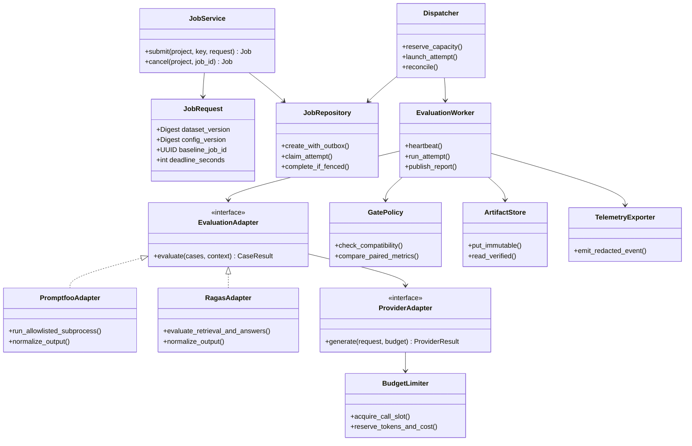
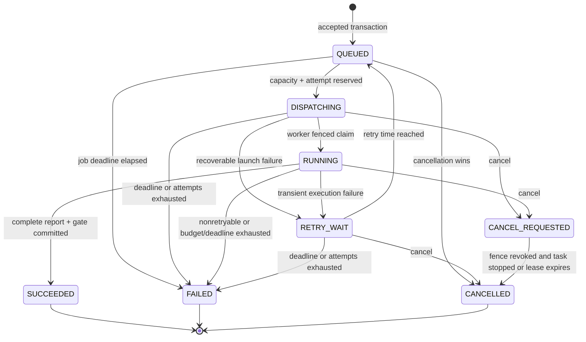

# Classes, state and persistence

Status: production implementation blueprint. The [local subset](docs/local-service.md) now implements request/response models, JobService, FileArtifacts and LocalWorker. Diagram names below describe target responsibilities; not every interface exists yet.

Ports/adapters isolate third-party output formats and subprocess lifecycle from domain decisions. Repository + transactional outbox make admission atomic. Strategy selects versioned metric implementations and gate policies. Dependency injection supplies provider clients, clocks and stores for failure tests; no dependency injection framework beyond FastAPI and constructors is needed. AsyncIO `TaskGroup`, bounded queues and semaphores coordinate cooperative work; subprocesses isolate blocking or incompatible evaluator engines. Cancellation must terminate subprocess groups as well as coroutines.

No terminal state transitions back. To rerun, submit a new job with a new idempotency key. Job retries increment the attempt and never replace completed evidence. Attempt states are `RESERVED`, `ACTIVE`, `COMPLETED`, `ABORTED`; attempt state and job state are separate. Cancellation/expiry revokes the active fence before a replacement attempt is permitted.

## Data model

| Record | Identity / relationship | Mutable fields and constraints |
|---|---|---|
| Project | UUID, token mapping | quotas and retention under audit |
| DatasetVersion / ConfigVersion | project + kind + digest | immutable canonical bytes and schema version |
| Job | project + UUID; dataset/config FKs | state, timestamps, current attempt, deadline; immutable request and baseline |
| Attempt | project + job + attempt number | task ARN, random fence, heartbeat, lease, status; one active attempt |
| Outbox | UUID + job + event type | dispatch lease and delivery time; replay safe |
| Report | project + job unique | immutable artifact locator, hash and schema version |
| Gate | stored in report transaction | verdict, reason codes, policy digest and metric decisions |
| Provider reservation | project/provider/account key | slots, tokens, estimated spend and expiry; shared across tasks |
| AuditEvent | append-only ID | actor, action, resource and outcome; no raw prompt |

The [SQL scaffold](infra/postgres/001_scaffold.sql) supplies core metadata tables and constraints for local exploration; production migrations still need row-level security policies, quota reservations, audit tables, partition/retention handling and migration tests. All cross-resource references must include project. A baseline FK is additionally checked for `SUCCEEDED` and compatible evidence in application logic.

Pydantic v2 implementation rules: request models forbid extras, validate SHA-256 and UUID shapes, use timezone-aware UTC timestamps, reject non-finite numbers, and validate cross-field invariants. Decimal USD values serialize as decimal strings. Frozen models do not make nested data immutable; canonical bytes and digest validation provide persisted immutability. Generated FastAPI OpenAPI must be checked against the [contract](contracts/openapi.json); validation failures map to the shared problem envelope rather than FastAPI's default error shape.
