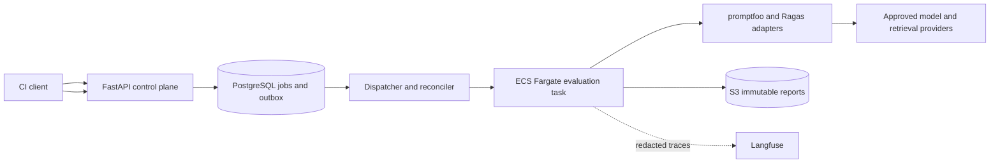

# LLM Regression Lab

A headless evaluation service designed to answer a release question: **did this prompt, model, or retrieval change improve the application without exceeding latency and cost budgets?** CI submits immutable evaluation inputs and receives an auditable comparison and an explicit gate verdict.

This portfolio project demonstrates AI systems architecture, asynchronous backend design, evaluation methodology, and production operations relevant to AI Engineer, LLM Systems Engineer, and Applied AI Systems Architect roles. It combines deterministic assertions with retrieval metrics and calibrated model judgments; a web frontend is outside the initial scope.

**Status: Phase 3.1 local service implemented.** FastAPI/Pydantic v2 endpoints, PostgreSQL persistence and migrations, project-scoped local bearer authentication, a separate AsyncIO worker, and verified filesystem artifacts work with fake providers and a real MiniMax-M3 adapter. Real promptfoo/Ragas evaluations, calibrated release gates, JWT/OIDC, distributed orchestration, S3/ECS deployment and measured production SLOs remain planned. **All local results produce an inconclusive release gate until calibration and statistical gating are implemented.** See the [local service guide](docs/local-service.md) for implemented behavior and limitations.

## Design at a glance



The diagram is the production target. The current local implementation uses FastAPI, AsyncIO, Pydantic v2 and PostgreSQL, a separate worker process, a filesystem artifact adapter and fake/MiniMax providers. AWS delivery, promptfoo/Ragas adapters and Langfuse remain planned.

## Planned consumption

These routes now have local handlers; production authentication and evaluation remain planned. Set `EVAL_URL` to `http://127.0.0.1:18080` for the local service and `EVAL_TOKEN` to a configured local token. Register versions first using the [local service guide](docs/local-service.md); its approved fake configuration differs from the illustrative production config. Replace synthetic identifiers and the baseline in [job.json](examples/job.json) with registered values (or null for a first baseline).

```bash
curl --fail-with-body -X POST "$EVAL_URL/v1/jobs" \
  -H "Authorization: Bearer $EVAL_TOKEN" \
  -H 'Content-Type: application/json' \
  -H 'Idempotency-Key: repo-sha-suite-attempt-1' \
  --data-binary @examples/job.json
# 202 + Location: /v1/jobs/<job_id>; poll that resource with backoff.
curl --fail-with-body "$EVAL_URL/v1/jobs/$JOB_ID" \
  -H "Authorization: Bearer $EVAL_TOKEN"
curl --fail-with-body "$EVAL_URL/v1/jobs/$JOB_ID/report" \
  -H "Authorization: Bearer $EVAL_TOKEN"
curl --fail-with-body "$EVAL_URL/v1/jobs/$JOB_ID/gate" \
  -H "Authorization: Bearer $EVAL_TOKEN"
```

The planned CLI maps `PASS` to exit 0, `REGRESSION` to 1, and `INCONCLUSIVE` or execution failure to 2. Pending is not success. See the [gate policy](docs/services/gating.md) and [CI blueprint](docs/delivery/ci-cd.md).

## Available locally

```powershell
python -m venv .venv
.venv\Scripts\python -m pip install -r requirements-local.lock -r requirements-dev.txt
.venv\Scripts\python scripts/validate_scaffold.py
Copy-Item .env.example .env # First run only; preserve an existing .env.
docker compose config --quiet
docker compose --profile local up -d --build --wait
$env:LAB_TOKEN='local-dev-token-change-me-0123456789abcdef'
.venv\Scripts\python scripts/local_demo.py
docker compose --profile local down
```

The `local` profile starts migrations, API, worker and PostgreSQL. Host API port is 18080; generated docs are at `/docs`. Set `LAB_TOKEN` to your configured key if changed. The demo verifies baseline, wrong-answer and provider-error flows over HTTP. Its exit 0 means the local diagnostic flow worked, not that a release passed. No provider keys or AWS account are needed. See [Operations.md](Operations.md) before resetting data. Contract regeneration is `python scripts/build_contract.py`; generated changes must be reviewed.

## Test with MiniMax

A provider is the external service that runs the model. The MiniMax adapter uses `MiniMax-M3` through the official OpenAI-compatible endpoint, matching the finance-agent project.

Add `MINIMAX_API_KEY=your-key` to your ignored `.env`, then run:

```powershell
docker compose --profile local up -d --build --wait
$env:LAB_TOKEN='local-dev-token-change-me-0123456789abcdef'
.venv\Scripts\python scripts/minimax_demo.py
```

This submits one real request, checks the answer, and prints reported token usage and estimated cost. It incurs provider usage. The key is passed only to the worker and is excluded from Git and Docker build context. The fake demo remains available without a provider key. See [MiniMax behavior](docs/local-service.md#minimax-provider) for limits and pricing assumptions.

## Evidence and next steps

| Capability | Current evidence | Next implementation proof |
|---|---|---|
| API contract | Strict FastAPI/Pydantic models, project/scope isolation tests and generated OpenAPI checks | Production OIDC/JWKS and RLS |
| Durable orchestration | Atomic job/outbox admission, idempotency, local worker, cancellation and fenced commit | Distributed leases, retries and spend reservations |
| Evaluation correctness | Bounded fake calls, assertions, synthetic reports and failure classification | Real adapter fixtures, calibration and statistical release gates |
| Deployment | Local Docker service, PostgreSQL tests, Terraform slice and production blueprints | Staging deployment, restore drill and rollback evidence |
| Performance | Proposed SLOs only | Dated load report with workload and image digest |

There are **no measured quality, latency, cost, or availability claims**. Synthetic examples are explicitly illustrative. [Validation evidence](docs/validation.md) records checks actually executed. [Implementation roadmap](docs/roadmap.md) defines acceptance criteria.

Start with [Architecture.md](Architecture.md), [Class.md](Class.md), [Index.md](Index.md), and [Operations.md](Operations.md). The original scope is preserved in [PROJECT_BRIEF.md](PROJECT_BRIEF.md).
